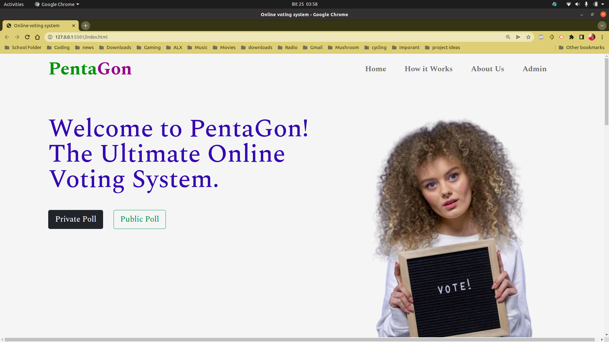
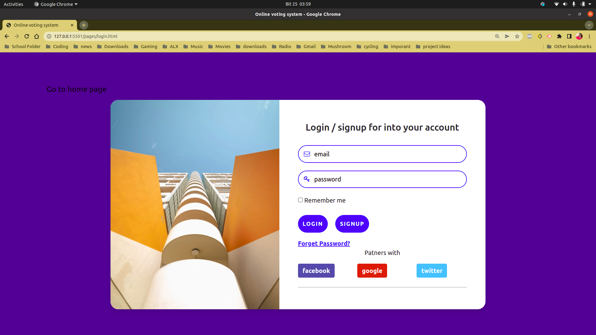
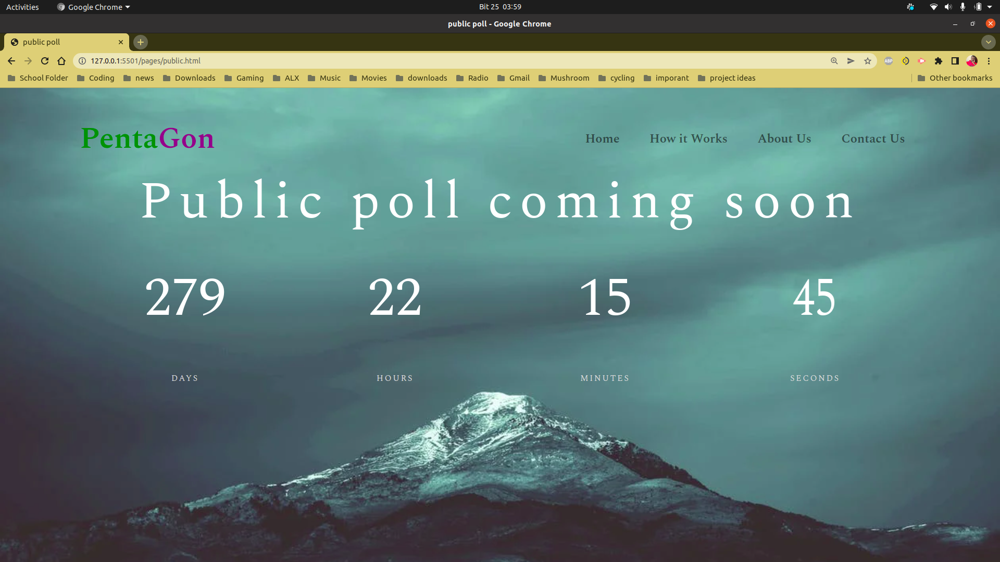
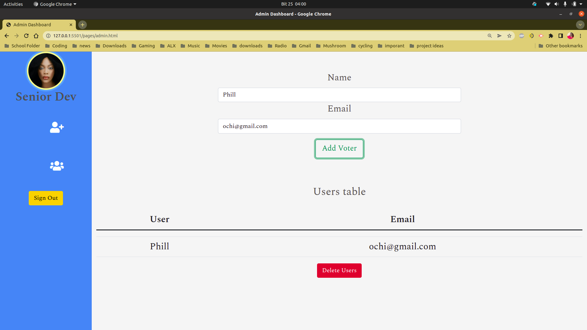

# Online voting system 

## v1.0 

## Authors Bruno Gatiba ,  Sandra Kinoti , Phillip Okeyo , Teddy Nyateya 

## Screenshots

## Installation Process 
* Cloning of the repo to your local machine 

* Open the cloned project using your preferred editor vscode , atom

* Serve the project and you are all good to go 

##  Requirements to run the project 

* All browsers are compatible 

## Technologies used 
* Firebase 
* HTML 
* CSS 
* BOOTSTRAP 
* jquery
* Javascript 

## license
* heres a link to my license [license](license)

 # live link to our project 
